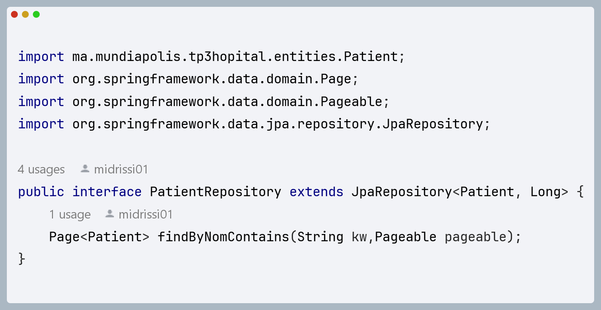

<h2>Enonce</h2>

Créer une application Web JEE basée sur Spring MVC, Thylemeaf et Spring Data JPA qui permet de gérer les patients. L'application doit permettre les fonctionnalités suivantes :

<ul>
<h3>Afficher les patients </h3>
<h4>Creation de l'entité Patient:</h4>
    

        Cette classe est annotée avec des annotations de Jakarta Persistence API (JPA) pour la liaison avec la base de données.
        Elle contient des propriétés telles que "id", "nom", "dateNaissance", "malade", et "score", représentant respectivement
        l'identifiant du patient, son nom, sa date de naissance, un indicateur de maladie, et un score associé.
        L'utilisation de Lombok simplifie la création des constructeurs et des méthodes d'accès aux propriétés.
    

<h4>Creation de PatientReopository basee sur Spring DATA</h4>

Cette interface est cruciale pour interagir avec la base de données et effectuer des opérations spécifiques liées aux patients.
Elle offre une abstraction puissante pour les requêtes de base de données et s'intègre facilement dans une application Spring Boot

<h4>Configuration de l'application application.proprities</h4>

Le fichier de configuration partagé, généralement nommé application.properties ou application.
yml, joue un rôle essentiel dans la définition des paramètres de configuration pour une application Spring Boot. Ces paramètres
permettent de définir le comportement de l'application,
en particulier en ce qui concerne la gestion de la base de données et d'autres aspects liés à l'environnement d'exécution.

<h4>Creation du controller Spring MVC</h4>

Le contrôleur déclare une dépendance sur la couche DAO (Data Access Object) à travers l'utilisation de l'annotation @AllArgsConstructor. Cela signifie que Spring injectera automatiquement une instance de la classe PatientRepository lors de la création d'une instance de PatientController. Le PatientRepository est une interface Spring Data JPA qui facilite l'interaction avec la base de données pour l'entité Patient.

<h4>Creation des vues basses sur thymleaf</h4>

</ul>

