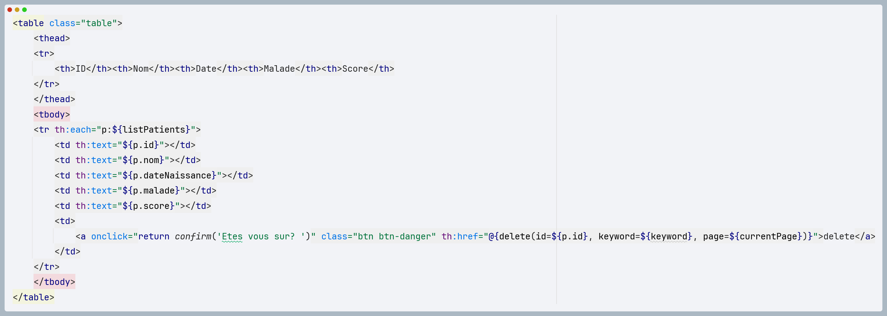

<h2>Enonce</h2>

Créer une application Web JEE basée sur Spring MVC, Thylemeaf et Spring Data JPA qui permet de gérer les patients. L'application doit permettre les fonctionnalités suivantes :

<ul>
<h3>Afficher les patients </h3>
<h4>Creation de l'entité Patient: </h4>
    

        Cette classe est annotée avec des annotations de Jakarta Persistence API (JPA) pour la liaison avec la base de données.
        Elle contient des propriétés telles que "id", "nom", "dateNaissance", "malade", et "score", représentant respectivement
        l'identifiant du patient, son nom, sa date de naissance, un indicateur de maladie, et un score associé.
        L'utilisation de Lombok simplifie la création des constructeurs et des méthodes d'accès aux propriétés.
    

<h4>Creation de PatientReopository basee sur Spring DATA</h4>

Cette interface est cruciale pour interagir avec la base de données et effectuer des opérations spécifiques liées aux patients.
Elle offre une abstraction puissante pour les requêtes de base de données et s'intègre facilement dans une application Spring Boot

<h4>Configuration de l'application application.proprities</h4>

Le fichier de configuration partagé, généralement nommé application.properties ou application.
yml, joue un rôle essentiel dans la définition des paramètres de configuration pour une application Spring Boot. Ces paramètres
permettent de définir le comportement de l'application,
en particulier en ce qui concerne la gestion de la base de données et d'autres aspects liés à l'environnement d'exécution.

<h4>Creation du controller Spring MVC</h4>

Le contrôleur déclare une dépendance sur la couche DAO (Data Access Object) à travers l'utilisation de l'annotation @AllArgsConstructor. Cela signifie que Spring injectera automatiquement une instance de la classe PatientRepository lors de la création d'une instance de PatientController. Le PatientRepository est une interface Spring Data JPA qui facilite l'interaction avec la base de données pour l'entité Patient.

<!-- Déclaration du contrôleur avec @Controller -->
<!-- Elle gère les requêtes HTTP de type GET -->
<!-- @AllArgsConstructor génère un constructeur avec un paramètre pour chaque champ de la classe -->
<!-- La méthode patients est associée à "/index" -->
<!-- Elle récupère une liste paginée de patients en fonction des paramètres fournis -->
<!-- et l'ajoute au modèle pour le rendu dans le modèle Thymeleaf -->

    
La classe est annotée avec @Controller, ce qui indique qu'il s'agit d'un contrôleur Spring MVC.

   Elle comporte plusieurs méthodes annotées avec @GetMapping qui gèrent les requêtes HTTP de type GET.
    L'annotation @AllArgsConstructor de Lombok génère un constructeur avec un paramètre pour chaque champ de la classe.
    La méthode patients est associée à "/index" et récupère une liste paginée de patients en fonction des paramètres fournis (page, taille, mot-clé).
    Elle l'ajoute au modèle pour le rendu dans le modèle Thymeleaf.

   La méthode delete est associée à "/delete"
   Elle supprime un patient par ID.
   
Après la suppression, elle redirige vers la page "/index" avec les paramètres appropriés.

La méthode home est associée à "/".
Elle redirige vers la page "/index".

<!-- La méthode lisPatients est associée à "/patients" -->
<!-- Elle renvoie une réponse JSON contenant la liste de tous les patients -->

    
La méthode lisPatients est associée à "/patients".

    
Elle renvoie une réponse JSON contenant la liste de tous les patients.

<h4>Creation des vues basses sur thymleaf</h4>

Le fichier HTML est un modèle Thymeleaf qui rend la liste des patients et propose une fonctionnalité de recherche.
Il inclut Bootstrap pour le style.
Le formulaire dans le modèle permet aux utilisateurs de rechercher des patients en fonction d'un mot-clé.
Les données des patients sont affichées dans un tableau, et il y a un bouton de suppression pour chaque patient.
Des liens de pagination sont fournis en bas de la page.

</ul>

